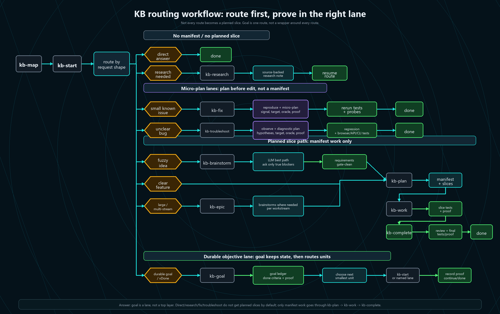

# Working Skill Repo

Portable KB workflow skills for GitHub Copilot and Codex.

Status: actively used, pre-1.0. Expect churn while the marketplace, eval, and
pipeline maintenance pieces settle.

Most of this repo is an augmentation layer on top of the original
All-The-Vibes ATV StarterKit and CE review/learning workflow. KB adds the
voice-friendly routing, project-memory map, fresh-session handoff loop,
proportional planning, and execution gates; it still depends on selected ATV
skills and reviewer agents. Original ATV `upstream/main` is a source to mine
for useful ATV-native changes, while this repo remains the source of truth for
the KB overlay and any KB replacements.

Most users only need the runtime skills. You do not need Go, the eval harness,
or the marketplace machinery to use the workflow in your own repo.

## Start Here

Clone this repo, install the skills, then ask `kb-start` to route your first
task from inside a project:

```powershell
git clone https://github.com/Irtechie/working-skill-repo.git
cd working-skill-repo
pwsh ./scripts/install-kb.ps1 -Target all
cd <your-project>
kb-start "what I want done"
```

`kb-start` is a skill invocation through Codex, Copilot/GHCP, or another agent
that has this bundle installed. It is not a standalone shell binary.

The core loop is six skills:

| Skill | Job |
| --- | --- |
| `kb-start` | Pick the smallest correct lane for the request |
| `kb-map` | Build or read repo-local memory so fresh sessions recover quickly |
| `kb-fix` | Handle narrow bugs and small contained edits |
| `kb-plan` | Turn clear work into vertical slices with verification |
| `kb-work` | Execute ready slices and prove each one |
| `kb-complete` | Review, fix follow-ups, refresh memory, and mark done |

Everything else is optional depth for bigger work, maintenance, or release
proof.

## What This Repo Contains

This repo is two things:

1. A portable KB runtime bundle that teaches an agent how to recover local
   project memory, route work by shape, execute vertical slices, test its own
   changes, review the result, and leave durable handoff/context files behind.
2. A development harness that tests whether the bundle, routes, sync targets,
   eval fixtures, marketplace rules, and release gates still match the claims.



## What Makes This Different

- `kb-start` routes work instead of forcing every request through one heavy
  workflow.
- `kb-map` keeps repo-local memory so fresh sessions can recover without chat
  history.
- `kb-plan` decomposes clear work into vertical slices with verification
  contracts.
- `kb-work` executes manifest slices using ready-set and scope-lease rules.
- `kb-complete` runs review, proof, follow-up cleanup, learning, and memory
  refresh.
- `cmd/kbcheck` is a maintainer gate for route fixtures, skill lint, sync
  drift, eval scoring, marketplace firebreaks, and release profiles.

## Routing And Rework Control

The core purpose is to stop treating every request like the same kind of work.
The harness is designed to avoid rework by choosing the smallest lane that can
still prove the result. That is the claim this repo can defend today: the
routes, gates, and checks exist in code and skills. It does not claim measured
token savings.

- **Fresh sessions by default.** Handoffs, `todo.md`,
  `docs/context/PROJECT.md`, plans, and architecture notes let a new session
  recover without carrying days of chat history.
- **Map once, then load narrowly.** `kb-map` builds or refreshes project memory,
  then future sessions follow exact pointers instead of crawling the repo.
- **Choose the smallest correct lane.** `kb-start` routes by task shape. Direct
  answers do not get a work gate. Small known bugs go to `kb-fix`. Unclear
  broken behavior goes to `kb-troubleshoot`. Material research goes to
  `kb-research`. Fuzzy ideas go to `kb-brainstorm`, then `kb-plan`. Clear
  bounded work can go straight to `kb-plan`.
- **Keep large work from becoming one giant context.** `kb-epic` coordinates
  multi-stream initiatives. It can run multiple workstream brainstorms, resolve
  planning blockers, and produce multiple manifests before execution.
- **Spend ceremony only where it prevents rework.** Slicing, checks, and review
  cost time up front. They earn their place only when they prevent the agent
  from guessing, drifting, or calling unverified work done.

KB means **Kanban-Based**. The workflow still uses boards, manifests, vertical
slices, and done archives, but user-facing commands use the shorter `kb-`
prefix because it works better with voice input.

## What Is Installed

This is not the full ATV StarterKit. It is a portable KB overlay plus its
development harness. The repository is intentionally larger than the installed
runtime surface.

The installed runtime surface is intentionally smaller than the repository:
about 37 skills plus 52 reviewer/specialist agents.

Installed/runtime surface:

- `.github/skills/*/SKILL.md` - portable skills
- `.github/agents/*.agent.md` - reviewer and specialist agents
- `AGENTS.md` - Codex/agent repo contract
- `.github/copilot-instructions.md` and `.github/instructions/*.instructions.md`
  - Copilot guidance
- `cmd/kbcheck` - optional Go quality/release gate entrypoint

Development scaffolding that is usually not copied into consuming projects:

- `docs/` - this bundle's own memory and reference docs
- `evals/` - route, quality, live-adapter, and benchmark fixtures
- `config/` - skill quality, marketplace, and pipeline config

Consuming projects get their own `todo.md`, `docs/context/`,
`docs/handoffs/`, eval map, and project-local memories.

## Quick Start

Use the `Start Here` install path above, then run `kb-start` from the target
project.

Normal flow:

```text
kb-start -> kb-map -> chosen lane
```

For a fully hands-off feature flow:

```text
klfg: kb-brainstorm -> kb-plan -> kb-work -> kb-complete
```

`kb-work` now owns the loop until the work is terminal. It pulls the safe ready
set from the manifest DAG, can swarm independent slices in isolated contexts,
serializes shared-checkout or observed-overlap work, then runs `kb-complete` for
review, follow-up resolution, proof, learning, memory refresh, and cleanup. "All
slices passed" is progress; `kb-complete` is the done gate.

## Execution Model

The pipeline is built around task shape, not a fixed ceremony:

- **Small:** `kb-fix` for known bugs, typos, and narrow edits; or
  `kb-troubleshoot` when broken behavior needs diagnosis. Identify or write a
  failing signal, make the smallest fix, verify deterministically, and stop if
  the loop stalls.
- **Medium:** `kb-brainstorm -> kb-plan -> kb-work` when framing or
  requirements need clarification before slicing. `kb-plan` writes vertical
  slices with expected files, verification, dependencies, and HITL flags.
- **Large:** `kb-epic` for migrations, rewrites, deletion policy, proof-harness
  changes, or multi-stream work. It breaks the initiative into multiple
  brainstorms or manifests before execution.

`kb-gate` owns P0-P4 phase policy. P0/P1 findings block progression but do not
automatically require a human; the agent fixes actionable issues itself and asks
for help only for product decisions, credentials, unsafe operations, or genuine
ambiguity. `kb-check` and `kb-functional-test` push verification into executable
checks instead of letting the model re-inspect behavior by hand.

## Common Commands

| Command | Use When |
| --- | --- |
| `kb-start` | Fresh session, ambiguous ask, or "figure out the right workflow" |
| `kb-task` | First-principles task runner that continues until verified or blocked |
| `kb-map` | Setup, lookup, or refresh project memory |
| `kb-eval-map` | Map repo-native eval surfaces and proof commands |
| `kb-fix` | Narrow bug, failing test, or small contained change |
| `kb-troubleshoot` | Broken behavior needs logs/browser/test investigation |
| `kb-brainstorm` | Product or technical framing is still unclear |
| `kb-research` | External docs, prior art, or framework/market behavior matters |
| `kb-architecture-deepening` | Explore where a codebase should get deeper, simpler, or more modular |
| `kb-plan` | Requirements exist and need vertical slices |
| `kb-work` | A manifest exists and should be executed |
| `kb-review` | KB-specific code review with structural quality review |
| `kb-complete` | Work needs review, proof, learning, memory, cleanup |
| `kb-memory-review` | High-cost pass for stale, bloated, or contradictory memory |
| `kb-ship` | Release, PR, deploy, or final readiness check |
| `kb-epic` | Large migration, rewrite, or multi-brainstorm initiative |
| `kb-compact` | Memory, docs, or output have gone too verbose |
| `klfg` | Fully hands-off route from brainstorm through completion |
| `repo-critic` | Claims-vs-code evidence review before a claim ships |

## Installed Skills

Routing and memory:

- `kb-start` - default router / lane picker
- `kb-map` - project-memory lookup, refresh, and project-root anchoring
- `kb-map-bootstrap` - expensive deep index plus standard memory layout
- `kb-compact` - compress memory/docs/output without losing technical truth
- `kb-handoff` - compact a session into a restart packet

Execution lanes:

- `kb-fix`, `kb-troubleshoot`, `kb-brainstorm`, `kb-research`
- `kb-architecture-deepening`, `kb-plan`, `kb-work`, `kb-complete`
- `kb-ship`, `kb-epic`, `kb-task`, `kb-first-principles`, `klfg`

Verification and gates:

- `kb-check` - deterministic verification harness
- `kb-functional-test` - functional/e2e/browser test strategy and audit
- `kb-gate` - shared P0/P1/P2/P3/P4 phase-gate policy
- `kb-qa` - per-slice QA gate
- `kb-repair` - surgical fix loop with stuck detection
- `kb-regression-snapshot` - capture/replay deterministic regression snapshots
- `kb-review` - tiered-persona structural review
- `kb-eval-map` - map repo-native eval surfaces and proof commands
- `kb-memory-review` - high-cost project-memory maintenance pass

Direct dependencies include `ce-review`, `ce-compound`,
`ce-compound-refresh`, `document-review`, `tdd`, `learn`, `evolve`,
`todo-create`, and `todo-triage`. Do not remove `kb-review`, `ce-review`,
`ce-compound`, or `ce-compound-refresh` unless the skills that invoke them are
rewritten first. `kb-complete` uses `kb-review`; `ce-review` remains the
generalized CE review skill.

## Project Memory

The workflow keeps memory in files so sessions can stay short.


Required consuming-project memory:

- `todo.md` - active work, blockers, parked work, handoff pointers
- `todo-done.md` - compact archive of completed work
- `docs/context/PROJECT.md` - fresh-session route map
- `docs/context/eval-map.md` - repo-native eval surfaces and proof commands
- `docs/context/architecture/` - architecture notes by domain
- `docs/context/operations/` - run/test/deploy/QA commands
- `docs/handoffs/active/` - resumable work
- `docs/handoffs/parked/` - valuable work that is not runnable today
- `docs/handoffs/done/` - completed or superseded handoffs

`kb-map` resolves the active project root first and reads memory only from that
repo. It must not search `~`, `.copilot/handoffs`, the whole drive, or sibling
repos unless explicitly asked for cross-repo lookup.

`kb-map-bootstrap` is the expensive setup path. `kb-map` invokes it when
`todo.md` or `docs/context/PROJECT.md` is missing, or when memory is badly
stale. Bootstrap inventories the repo, creates the standard memory layout,
builds the eval map, and route-tests the result before normal lookup resumes.

`kb-handoff` writes restart packets under `docs/handoffs/active/` and, when
project memory already exists, adds a compact `todo.md` pointer. A handoff is
not an executable plan and does not bootstrap memory by itself; the next session
comes back through `kb-map`.

Deep dive: [KB workflow architecture](docs/context/architecture/kb-workflow.md).

## Review Agents

The reviewer agents are runtime dependencies, not optional docs. Removing them
causes `document-review`, `kb-review`, `ce-review`, `kb-complete`, and related
gates to fail or degrade.

Always-on KB code review personas:

- `correctness-reviewer`
- `testing-reviewer`
- `thermo-nuclear-code-quality-reviewer`
- `project-standards-reviewer`

Conditional reviewers include security, performance, API contracts, migrations,
reliability, frontend races, schema drift, deployment, prior comments,
language-specific reviewers, and adversarial review.

Document-review uses its own lens agents: coherence, feasibility, product,
design, security, scope, and adversarial document review.

Deep dive: [KB workflow architecture](docs/context/architecture/kb-workflow.md)
and [kb-review persona catalog](.github/skills/kb-review/references/persona-catalog.md).

## Quality Gates

The harness is not just install plumbing. `cmd/kbcheck` validates route
fixtures, skill structure, sync drift, marketplace firebreaks, eval result
scoring, baseline regression checks, and release readiness.

The Go tooling follows the repo's `go.mod` version requirement (`go 1.26` at
the time of writing).

Run before propagating skill changes:

```powershell
go run .\cmd\kbcheck core
```

Run before releasing or syncing globals:

```powershell
go run .\cmd\kbcheck local-release
```

`local-release` composes deterministic local proof: native `core`, sync drift,
line-ending checks, static reports, and the available local eval surfaces.
For unattended runners, required sync drift is a release blocker. The repo is
the source of truth; globals are deployed copies. If a global copy contains
newer useful behavior, merge it back into this repo first, prove it here, then
sync outward.
`live-release` is explicit:

```powershell
go run .\cmd\kbcheck live-release
```

Live mode may call authenticated Codex/GHCP CLIs. A local green gate is not a
claim that live model evals ran.

The current gate is Go-native. PowerShell is no longer required for the
skill-repo quality suite.

Useful subcommands:

- `core --list` / `core --dry-run` - list or dry-run core gate steps
- `local-release`, `live-release` - release-readiness gates
- `skill-lint` - deterministic `SKILL.md` structure lint
- `skill-sync-report` - read-only drift report across install targets
- `route-eval` - validate `evals/route-complexity/*` fixtures
- `skill-eval`, `skill-eval-claims`, `skill-eval-quality`,
  `skill-eval-regression` - prompt/trace/claim/quality eval surfaces
- `eval-run-codex`, `eval-run-ghcp`, `eval-run-live-corpus`,
  `skill-eval-wrap` - dry-run/live adapters and observed-trace wrapping
- `minimality`, `surface-report` - loaded-surface and trim measurement
- `ready-set`, `scope-lease` - swarm execution proof helpers used by `kb-work`
- `atv-delta` - upstream ATV drift report
- `marketplace-firebreak`, `marketplace-promote` - private marketplace checks
  and promotion path

Two PowerShell helpers remain for narrow skill jobs:
`kb-regression-snapshot/scripts/kb-regression-snapshot.ps1` and
`kb-map-bootstrap/scripts/code-intel.ps1`.

Deep dive: [testing operations](docs/context/operations/testing.md) and
[eval map](docs/context/eval-map.md).

## Install

Default to personal/global installs. They keep active project repos clean and
avoid skill drift between copies.

The snippets below assume PowerShell and that `$src` points to your clone.
Adjust `$src` and `$dst` for your machine.

One-command install:

```powershell
pwsh ./scripts/install-kb.ps1 -Target all
```

GitHub Copilot personal install:

```powershell
$src = '<path-to-working-skill-repo>'
Copy-Item "$src\.github\skills\*" "$env:USERPROFILE\.copilot\skills" -Recurse -Force
Copy-Item "$src\.github\agents\*" "$env:USERPROFILE\.copilot\agents" -Force
```

Codex personal install:

```powershell
$src = '<path-to-working-skill-repo>'
Copy-Item "$src\.github\skills\*" "$env:USERPROFILE\.codex\skills" -Recurse -Force
Copy-Item "$src\.github\agents\*" "$env:USERPROFILE\.codex\agents" -Force
```

Shared agent-skills install:

```powershell
$src = '<path-to-working-skill-repo>\.github\skills'
Copy-Item "$src\*" "$env:USERPROFILE\.agents\skills" -Recurse -Force
```

Use repo-local installs only when a project needs pinned/project-specific
overrides or when the skills should be versioned with that codebase.

Repo-local install:

```powershell
$src = '<path-to-working-skill-repo>'
$dst = '<path-to-your-project>'
Copy-Item "$src\.github\skills" "$dst\.github\skills" -Recurse -Force
Copy-Item "$src\.github\agents" "$dst\.github\agents" -Recurse -Force
Copy-Item "$src\AGENTS.md" "$dst\AGENTS.md" -Force
Copy-Item "$src\.github\copilot-instructions.md" "$dst\.github\copilot-instructions.md" -Force
```

Deep dive: [skill bundle maintenance](docs/context/operations/skill-bundle-maintenance.md).

## Platform Reality

This repo supports Codex and GitHub Copilot/GHCP instruction surfaces. The
development machine is Windows, so examples use Windows paths.

Current state:

- Go owns the quality, release, eval, marketplace, and drift-report gates.
- Windows parity smoke proof is recorded in `docs/reports/go-gate-parity-2026-06-01.md`.
- macOS/Linux should use the same Go entrypoint; full OS proof is still parked
  until those machines are available.

## Marketplace And Security

`<agent-marketplace>` is a private approved catalog, not a global install. New
skills and pipelines should prove themselves project-local first, then move into
the marketplace only after evidence, review, hash pinning, and human approval.

Public imports go to quarantine first. Quarantine is an enforced firebreak:
active and approved skill roots must not resolve into quarantine.

`atv-security` is the current approved ATV security skill, but it lives in the
approved marketplace/global skill surface rather than this KB overlay. Dependency
vulnerability proof prefers OSV Scanner machine evidence when `osv-scanner` is
installed.

Deep dive:

- [private skill marketplace](docs/context/architecture/private-skill-marketplace.md)
- [skill bundle maintenance](docs/context/operations/skill-bundle-maintenance.md)

## What Is Not Bundled

These are intentionally left out of the portable runtime bundle:

- upstream `deepen-*` passes; use `kb-research` and proportional research
- one-shot LFG/SLFG style workflows; use `klfg` only when you want the full
  pipeline
- upstream `workflows-*` aliases; use KB lanes directly unless a current app
  explicitly needs an ATV alias
- `land`; shipping remains a deliberate separate decision
- browser tools such as `agent-browser`; skills can call them when installed,
  but this repo does not vendor them

The useful LFG finish pattern is preserved inside `kb-complete`: resolve
follow-up review/TODO work, rerun proof on the final diff, capture demo evidence
when useful, then compound, learn, evolve, refresh memory, compact, clean up, and
alert.

## Skill Quality Bar

KB skills should be structured, not brain dumps:

- frontmatter says exactly when to use the skill
- the body states the job, non-goals, and output contract
- workflows are split into phases with hard gates
- file paths, commands, and artifact locations are explicit
- questions are driven by blocking decisions, not a quota
- shared doctrine lives once and is referenced elsewhere
- long research, agent prompts, and scripts are lazy-loaded when needed

Every token must pay rent. Keep contracts, gates, paths, commands, error
handling, verification criteria, and escalation thresholds. Cut generic
programming advice, motivational text, repeated warnings, and long examples that
modern models do not need.

## Credits

This repo is primarily based on the ATV / All The Vibes skill set and its
Compound Engineering workflow.

It also borrows useful ideas from:

- [Matt Pocock's skills](https://github.com/mattpocock/skills), especially small
  composable workflow skills and vertical slicing
- [G-Stack](https://github.com/garrytan/gstack), especially persistent workflow
  memory, QA ownership, and operating-system-style orchestration
- [kevin-copilot](https://github.com/shyamsridhar123/kevin-copilot), especially
  terse Copilot-first instruction surfaces

The goal is not to copy any one system. The goal is to keep the pieces that make
agents easier to route, easier to resume, and harder to let off the hook.
