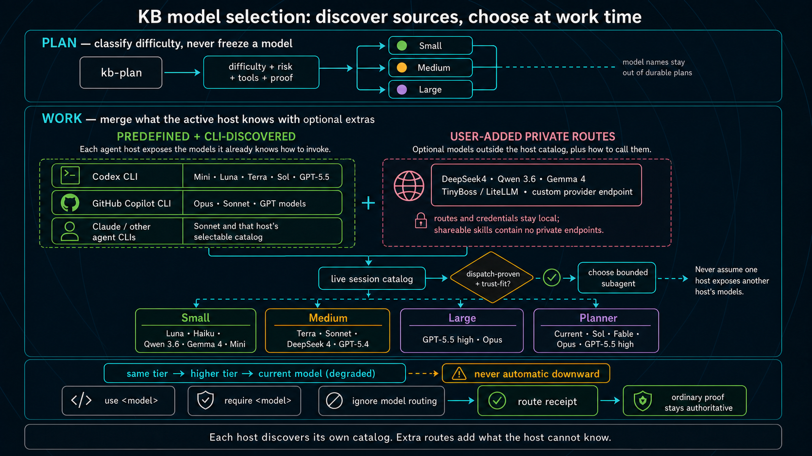

# Working Skill Repo

Portable KB workflow skills for GitHub Copilot and Codex.

Status: actively used, pre-1.0. Expect churn while the marketplace, eval, and
pipeline maintenance pieces settle.

This standalone bundle grew from ideas in the original All-The-Vibes ATV
StarterKit and CE review/learning workflow. KB now owns the copied and adapted
skills here: voice-friendly routing, project memory, fresh-session handoff,
proportional planning, reviewer agents, and execution gates. No ATV checkout is
an install, sync, release, or delivery dependency.

Most users only need the runtime skills. You do not need Go, the eval harness,
or the marketplace machinery to use the workflow in your own repo.

## Start Here

Clone this repo, install the skills, then ask `kb-start` to route your first
task from inside a project:

```shell
git clone https://github.com/Irtechie/working-skill-repo.git
cd working-skill-repo
npx github:Irtechie/working-skill-repo --target all --profile core
cd <your-project>
kb-start "what I want done"
```

`kb-start` is a skill invocation through Codex, Copilot/GHCP, or another agent
that has this bundle installed. It is not a standalone shell binary.

The core loop is six skills:

| Skill | Job |
| --- | --- |
| `kb-start` | Pick the smallest correct lane for the request |
| `kb-map` | Build or read repo-local memory so fresh sessions recover quickly |
| `kb-fix` | Handle narrow bugs and small contained edits |
| `kb-plan` | Turn clear work into vertical slices with verification |
| `kb-work` | Execute ready slices and prove each one |
| `kb-complete` | Take a feature, plan, or manifest to its configured local, PR, or direct endpoint |

Everything else is an internal phase, compatibility alias, or optional depth.

Optional `kb-configure` writes portable per-project execution policy. Most users
never need it. Planned-tier execution is the default; substantive next-lower
Adaptive Model Routing (AMR) attempts are disabled until explicit pilot/opt-in
or promotion. When enabled, AMR makes at most one attempt before proof. Failure
produces a bounded handoff followed by separate ordinary planned-tier execution,
not automatic correction. Optional user-local `kb-models` state saves
`automatic`, `self-hosted-first`, or `native-first` source preference without
configuring model-by-model plan mappings.

For one state-aware plan-to-endpoint run, use:

```text
kb-complete <feature-or-plan-or-manifest>
```

It recovers the current phase, runs planning, work, and finalization as needed,
then applies project delivery policy: local-only, PR, or explicitly authorized
direct integration and post-integration sync.

For long-lived objectives that may run across days or sessions, use `kb-goal`.
It keeps the durable objective and terminal proof ledger, then routes each work
unit through the normal KB lanes. `klfg` is one strict idea-to-done pipeline;
`kb-goal` can run many pipelines or smaller lanes until the larger goal is
complete or honestly blocked. Under a goal, brainstorming is low-interruption:
the agent picks the best path from evidence and asks only for true planning
blockers.

For recurring or trend-improvement goals, `kb-goal` can also record a live
steering loop: set point, sensor, controller, actuator, scope gate, batch size,
WIP bound, dampener, and steering memory. This is optional. It helps repeated
runs learn from durable feedback without replacing `kb-finalize`, `learn`, or
`evolve`.

The default installer profile is the runtime dependency closure. `core`
installs every runtime skill plus the baseline review/document agents needed by
the normal KB loop. `full` installs the same skills plus every
reviewer/specialist agent. The Go gate and marketplace are maintainer tools;
they are not required to start using the workflow.

## What This Repo Contains

This repo is two things:

1. A portable KB runtime bundle that teaches an agent how to recover local
   project memory, route work by shape, execute vertical slices, test its own
   changes, review the result, and leave durable handoff/context files behind.
2. A development harness that tests whether the bundle, routes, sync targets,
   eval fixtures, marketplace rules, and release gates still match the claims.

## How Planning, Routing, And AMR Fit Together

KB separates three decisions that agents often blur together:

1. **Planning sets authority.** `kb-plan` classifies each slice as small,
   medium, or large from difficulty, risk, required tools/context, and the proof
   needed to accept it. The plan does not freeze a model, provider, endpoint,
   transport, or source preference.
2. **Work-time routing chooses an available worker.** Immediately before a
   slice runs, `kb-work` considers what the active host can actually invoke and
   any optional user-local routes. The current master selects a bounded,
   dispatch-qualified worker at the planned tier, a qualified same-tier route,
   or a higher tier. It never assumes another host's catalog and never infers a
   downward route.
3. **Proof accepts the result.** A routing receipt records what ran; it does not
   make the work correct. Tests, lint, browser assertions, API probes, or another
   objective check remain authoritative.

### Difficulty-Driven Routing (DDR)

DDR is shorthand for that decision pattern, not a separate command or artifact
created by `kb-plan`. Planning records difficulty and proof; execution discovers
the live catalog and chooses from evidence.



The model labels in the diagram are illustrative snapshots. They are not a
durable shared catalog. A new user can use KB with zero model setup because the
active host already knows its own models. Advanced users can add local or
external OpenAI-compatible/LiteLLM routes through user-local `kb-models` state,
then save a project preference such as `automatic`, `self-hosted-first`, or
`native-first`. Credentials and private endpoints never enter plans or shared
skills.

Run-only controls remain explicit:

- `use <model>` prefers an eligible route for this run;
- `require <model>` hard-pins it or fails;
- `ignore model routing` stays on the current driver;
- fallback goes same tier, then higher tier, then the current model in degraded
  mode—never automatically downward.

### Adaptive Model Routing (AMR)

AMR is a narrower, optional optimization inside this system. If a task was
planned at medium but is settled, bounded, and objectively provable, an enabled
pilot may try exactly one dispatch-qualified next-lower-tier worker. It is not a
general instruction to use cheaper models for all code.


Good candidates include a narrow code fix or implementation of an approved HTML
design with browser assertions. Philosophy, speculative product/design work,
unresolved architecture, subjective intent, sensitive boundaries, and weak
proof are bad candidates and begin at the planned tier.

If focused proof passes, KB keeps the result and continues ordinary QA,
regression, and review. If it fails, lower-tier retries stop. The driver receives
the exact failed criterion, location/hunk, invariants, accepted diff, ledger, and
proof output so the planned-tier authority can correct the smallest necessary
surface. Automatic live-checkout correction is currently disabled; failure uses
separate ordinary planned-tier execution. AMR is disabled by default and makes
no savings claim until worker + proof + repair repeatedly beats direct execution
without reducing correctness.

## What Makes This Different

- `kb-start` routes work instead of forcing every request through one heavy
  workflow.
- `kb-map` keeps repo-local memory so fresh sessions can recover without chat
  history.
- `kb-plan` decomposes clear work into vertical slices with verification
  contracts.
- `kb-work` executes manifest slices using ready-set and scope-lease rules.
- At execution time, the current master may choose a dispatch-qualified worker
  from the bounded live catalog; otherwise it uses the planned-tier current-model
  path. Durable plans contain tier/proof, never model or transport advice. The
  current master chooses host-native routes
  automatically. `kb-models` configures optional user-local
  OpenAI-compatible/LiteLLM extras; no generic MCP model dispatch is claimed.
  Ordinary work silently uses `automatic` when the project has no saved choice.
  Explicit setup may save `automatic`, `self-hosted-first`, or `native-first`.
  Connection details stay user-local, the receipt records
  what actually ran; only a route-bound receipt linked to proof establishes
  `dispatch-proven`, and only `require <model>` hard-pins.
- A plan tier is correction authority, not the validator. For settled, bounded,
  objectively provable work, an enabled AMR pilot may try the next lower tier.
  Deterministic proof accepts the result or produces a bounded correction
  handoff. Automatic correction dispatch is currently disabled: without an
  isolated workspace and compare-and-swap apply runner, it would risk changing
  the live checkout before validation. Failed attempts therefore record
  separate ordinary planned-tier execution and no preserved-work savings.
  Subjective intent, weak proof, sensitive
  boundaries, and unresolved architecture start at the planned tier.
- `kb-finalize` runs internal review, proof, follow-up cleanup, learning, and
  memory refresh.
- `kb-complete` is the single user-facing state-aware orchestrator through
  configured delivery.
- `kb-goal` can keep a human on long-running loops through concise steering
  memory that affects future runs.
- `cmd/kbcheck` is a maintainer gate for route fixtures, skill lint, eval
  scoring, marketplace firebreaks, sync drift, and release profiles.
- Material slices may carry vendor-neutral context packets so bounded workers
  receive exact files, prefetch, constraints, proof targets, search policy, and
  escalation triggers instead of rediscovering the repo.
- `kbcheck provider-hygiene` rejects Phoenix activation while allowing CCE as
  an optional adapter. `surface-report` separates base startup from conditional
  skill cost.

## Routing And Rework Control

The core purpose is to stop treating every request like the same kind of work.
The harness is designed to avoid rework by choosing the smallest lane that can
still prove the result. That is the claim this repo can defend today: the
routes, gates, and checks exist in code and skills. It does not claim measured
token savings.

Model selection follows the same split. `kb-plan` records the slice difficulty,
risk, tools, context, and proof without freezing a model name. `kb-work`
starts from the active host's own live catalog, then merges optional user-local
OpenAI-compatible/LiteLLM extras. Extra origin, hosting class, and trust are
independent: an extra may be self-hosted, provider-hosted, or unknown. Selection
falls sideways and then upward; it never infers a downward fallback. Routing
receipts are attribution evidence, while deterministic work proof remains the
acceptance authority. Endpoints, auth references, approvals, and personal
source priority stay user-local.

Current evidence is deliberately conservative:

| Surface | Status |
| --- | --- |
| Planned-tier/current-model execution and ordinary proof | Supported skill fallback |
| Selector, handoff validation, correction refusal, and fallback mechanics | Deterministic conformance only |
| Codex CLI plus a trusted OpenAI-compatible/LiteLLM route | Candidate; live support not qualified |
| Next-lower AMR attempts | Disabled by default; not promoted |
| Automatic surgical correction | Unsupported; fails closed before worker launch or mutation |
| GHCP, exact Codex App attribution, TinyBoss, generic MCP, direct chat-completions worker | Parked |

The current no-paid release artifact has zero supported cohorts and makes no
live cost, latency, token, or savings claim.

- **Fresh sessions by default.** Handoffs, `todo.md`,
  `docs/context/PROJECT.md`, plans, and architecture notes let a new session
  recover without carrying days of chat history.
- **Map once, then load narrowly.** `kb-map` builds or refreshes project memory,
  then future sessions follow exact pointers instead of crawling the repo.
- **Choose the smallest correct lane.** `kb-start` routes by task shape. Direct
  answers do not get a work gate. Small known bugs go to `kb-fix`. Unclear
  broken behavior goes to `kb-troubleshoot`. Material research goes to
  `kb-research`. Fuzzy ideas go to `kb-brainstorm`, then `kb-plan`. Clear
  bounded work can go straight to `kb-plan`.
- **Do not force every lane into a planned slice.** Planned slices are for
  manifest work. `kb-fix` and `kb-troubleshoot` use compact pre-edit plans and
  lane-local proof unless the bug grows into multi-slice work.
- **Make phase handoffs explicit.** If a host does not auto-chain skills, the
  active skill prints the exact next command. After a gate-clean brainstorm it
  asks whether to continue with `kb-plan <requirements-doc>`; after planning it
  asks whether to continue with `kb-work <manifest-path>`.
- **Keep large work from becoming one giant context.** `kb-epic` coordinates
  multi-stream initiatives. It can run multiple workstream brainstorms, resolve
  planning blockers, and produce multiple manifests before execution.
- **Spend ceremony only where it prevents rework.** Slicing, checks, and review
  cost time up front. They earn their place only when they prevent the agent
  from guessing, drifting, or calling unverified work done.
- **Complete to the configured endpoint.** `kb-complete` resumes from source,
  plan, active work, or reviewed manifest. `kb-work` auto-invokes only internal
  `kb-finalize`, so ordinary work never publishes by accident.

KB means **Kanban-Based**. The workflow still uses boards, manifests, vertical
slices, and done archives, but user-facing commands use the shorter `kb-`
prefix because it works better with voice input.

## What Is Installed

This is not the full ATV StarterKit. It is a portable KB overlay plus its
development harness. The repository is intentionally larger than the installed
runtime surface.

The installed runtime surface is intentionally smaller than the repository:
about 38 skills plus 52 reviewer/specialist agents.

Installed/runtime surface:

- `.github/skills/*/SKILL.md` - portable skills
- `.github/agents/*.agent.md` - reviewer and specialist agents
- `AGENTS.md` - Codex/agent repo contract
- `.github/copilot-instructions.md` and `.github/instructions/*.instructions.md`
  - Copilot guidance
- `cmd/kbcheck` - optional Go quality/release gate entrypoint

Development scaffolding that is usually not copied into consuming projects:

- `docs/` - this bundle's own memory and reference docs
- `evals/` - route, quality, live-adapter, and benchmark fixtures
- `config/` - skill quality, marketplace, and pipeline config

Consuming projects get their own `todo.md`, `docs/context/`,
`docs/handoffs/`, eval map, and project-local memories.

## Optional Context Providers

CCE is an owned, supported optional context adapter. This bundle does not
require CCE, MCP search, a vector index, or any background app. The default path
stays file-native: repo files, `rg`, `kb-map`, `docs/context/`, and
deterministic `kbcheck` gates.

Optional context tools can still fit as adapters. A good adapter may accelerate
lookup, chunk expansion, or decision recall, but it must have a repo-native
fallback and must not be required by install, sync, tests, or skill execution.
Do not commit or auto-start provider-specific hook/config files such as
`.mcp.json` or `.claude/settings.json`. Keep the enabled tool set narrow and
prefer deterministic CLI prefetch for data the agent will always need.

Phoenix is credited prior art for specific proof and recovery mechanics. KB's
routing and vertical slicing were developed independently. The current bundle
does not require a Phoenix runtime, while focused MCP interoperability remains a
valid future option when it improves installation or cross-host use.

Maintainers can audit repo-local provider config with `go run ./cmd/kbcheck
provider-hygiene`, or include standard user config with `go run ./cmd/kbcheck
provider-hygiene --include-user`. CCE entries are reported as optional; active
Phoenix provider entries fail.

## Quick Start

Use the `Start Here` install path above, then run `kb-start` from the target
project.

Normal flow:

```text
kb-start -> kb-map -> chosen lane
```

For a fully hands-off feature flow:

```text
kb-complete: brainstorm when needed -> plan -> work -> finalize -> delivery
```

`kb-work` now owns the loop until the work is terminal. It pulls the safe ready
set from the manifest DAG, can swarm independent slices in isolated contexts,
serializes shared-checkout or observed-overlap work, then runs `kb-finalize` for
review, follow-up resolution, proof, learning, memory refresh, and cleanup. "All
slices passed" is progress; finalization and configured delivery determine done.

## Execution Model

The pipeline is built around task shape, not a fixed ceremony:

- **Small:** `kb-fix` for known bugs, typos, and narrow edits; or
  `kb-troubleshoot` when broken behavior needs diagnosis. Identify or write a
  failing signal, write a compact pre-edit plan, make the smallest fix, rerun
  the relevant tests/probes, and stop if the loop stalls.
- **Medium:** `kb-brainstorm -> kb-plan -> kb-work` when framing or
  requirements need clarification before slicing. `kb-plan` writes vertical
  slices with expected files, verification, dependencies, and HITL flags.
- **Large:** `kb-epic` for migrations, rewrites, deletion policy, proof-harness
  changes, or multi-stream work. It breaks the initiative into multiple
  brainstorms or manifests before execution.

`kb-gate` owns P0-P4 phase policy. P0/P1 findings block progression but do not
automatically require a human; the agent fixes actionable issues itself and asks
for help only for product decisions, credentials, unsafe operations, or genuine
ambiguity. `kb-check` and `kb-functional-test` push verification into executable
checks instead of letting the model re-inspect behavior by hand.

`kb-brainstorm`, `kb-plan`, `kb-gate`, `kb-epic`, and `klfg` share a workflow
governor contract: unresolved `ask-now` or `research-first` questions block
planning, safe assumptions must be recorded with proof, and later phases advance
through gate-ledger records rather than chat confidence. The maintainer proof is
`go run ./cmd/kbcheck workflow-governor-selftest`, included in `core`.

Phoenix-style self-healing proof is folded into KB as a local proof spine:
`kbcheck sense` records runnable RED/GREEN observations, `kbcheck trace-verify`
checks trace integrity, and `kbcheck accept` only accepts repairs with the same
check observed RED before GREEN. Learning improvements stay local/scoped unless
`kbcheck learning-adoption` proves enough measured gain without regressions or
holdout leakage.

KB proof-spine integration status as of July 9, 2026:

- **Done:** proof spine commands, measured learning-adoption gate, model-tier /
  model-route planning guidance, manifest `done_check` / per-slice
  `proof_check` validation, KB-native `.kb/runs/<goal>/` route-history guards,
  snapshot path cleanup, `kbcheck doctor` install drift repair, and
  dishonest-completion rejection fixtures.
- **Outstanding:** broader live-run corpus and optional execution of recorded
  `proof_check` commands from `manifest-contract`.
- **Plan:** `docs/plans/2026-07-09-010-kb-phoenix-routing-slicing-absorption-manifest.md`.
- **Measured KB result:** `docs/results/2026-07-09-kb-phoenix-routing-slicing-result.md`.
- **Public proof note:** `LICENSE` and deterministic eval fixtures already
  exist. KB publishes its own deterministic fixture result and does not borrow
  Phoenix metrics.

> **Interoperability note:** ATV-Phoenix and KB both provide lifecycle entry
> points such as planning, building, and debugging. Choose one suite to own
> lifecycle routing in a given agent installation; Phoenix proof/MCP components
> can still be evaluated as focused integrations. To select the KB core profile:
> ```shell
> npx github:Irtechie/working-skill-repo --target all --profile core --yes
> ```
> or manually delete `~/.copilot/skills/phoenix*`,
> `~/.agents/skills/phoenix*`, `~/.codex/skills/phoenix*`.

## Common Commands

| Command | Use When |
| --- | --- |
| `kb-start` | Fresh session, ambiguous ask, or "figure out the right workflow" |
| `kb-goal` | Long-lived objective that must keep moving across sessions until proven complete or blocked |
| `kb-task` | First-principles task runner that continues until verified or blocked |
| `kb-map` | Setup, lookup, or refresh project memory |
| `kb-eval-map` | Map repo-native eval surfaces and proof commands |
| `kb-fix` | Narrow bug, failing test, or small contained change |
| `kb-troubleshoot` | Broken behavior needs logs/browser/test investigation |
| `kb-brainstorm` | Product or technical framing is still unclear |
| `kb-research` | External docs, prior art, or framework/market behavior matters |
| `kb-architecture-deepening` | Explore where a codebase should get deeper, simpler, or more modular |
| `kb-plan` | Requirements exist and need vertical slices |
| `kb-work` | A manifest exists and should be executed |
| `kb-review` | KB-specific code review with structural quality review |
| `kb-complete` | Feature/plan/manifest should reach its configured endpoint |
| `kb-finalize` | Internal post-work review, proof, learning, memory, cleanup |
| `kb-memory-review` | High-cost pass for stale, bloated, or contradictory memory |
| `kb-ship` | Internal commit, push, and PR delivery phase |
| `kb-land` | Internal merge/direct integration and post-integration sync phase |
| `kb-finish` | Deprecated alias to `kb-complete` |
| `kb-epic` | Large migration, rewrite, or multi-brainstorm initiative |
| `kb-compact` | Memory, docs, or output have gone too verbose |
| `klfg` | Deprecated alias to `kb-complete` |
| `repo-critic` | Claims-vs-code evidence review before a claim ships |

## Installed Skills

Routing and memory:

- `kb-start` - default router / lane picker
- `kb-goal` - durable objective lane across sessions and KB routes
- `kb-map` - project-memory lookup, refresh, and project-root anchoring
- `kb-map-bootstrap` - expensive deep index plus standard memory layout
- `kb-compact` - compress memory/docs/output without losing technical truth
- `kb-handoff` - compact a session into a restart packet

Execution lanes:

- `kb-fix`, `kb-troubleshoot`, `kb-brainstorm`, `kb-research`
- `kb-architecture-deepening`, `kb-plan`, `kb-work`, `kb-finalize`, `kb-complete`
- `kb-ship`, `kb-land`, `kb-finish`, `kb-epic`, `kb-task`, `kb-goal`,
  `kb-first-principles`, `klfg`

Verification and gates:

- `kb-check` - deterministic verification harness
- `kb-functional-test` - functional/e2e/browser test strategy and audit
- `kb-gate` - shared P0/P1/P2/P3/P4 phase-gate policy
- `kb-qa` - per-slice QA gate
- `kb-repair` - surgical fix loop with stuck detection
- `kb-regression-snapshot` - capture/replay deterministic regression snapshots
- `kb-review` - tiered-persona structural review
- `kb-eval-map` - map repo-native eval surfaces and proof commands
- `kb-memory-review` - high-cost project-memory maintenance pass

Direct dependencies include `ce-review`, `ce-compound`,
`ce-compound-refresh`, `document-review`, `tdd`, `learn`, `evolve`,
`todo-create`, and `todo-triage`. Do not remove `kb-review`, `ce-review`,
`ce-compound`, or `ce-compound-refresh` unless the skills that invoke them are
rewritten first. `kb-finalize` uses `kb-review`; `ce-review` remains the
generalized CE review skill.

## Project Memory

The workflow keeps memory in files so sessions can stay short.


Required consuming-project memory:

- `todo.md` - active work, blockers, parked work, handoff pointers
- `todo-done.md` - compact archive of completed work
- `docs/context/PROJECT.md` - fresh-session route map
- `docs/context/eval-map.md` - repo-native eval surfaces and proof commands
- `docs/context/architecture/` - architecture notes by domain
- `docs/context/operations/` - run/test/deploy/QA commands
- `docs/handoffs/active/` - resumable work
- `docs/handoffs/parked/` - valuable work that is not runnable today
- `docs/handoffs/done/` - completed or superseded handoffs

Optional recurring-loop memory:

- `docs/context/operations/steering/<slug>.md` - concise durable feedback for a
  specific long-running goal when the goal ledger would get too noisy

`kb-map` resolves the active project root first and reads memory only from that
repo. It must not search `~`, `.copilot/handoffs`, the whole drive, or sibling
repos unless explicitly asked for cross-repo lookup.

`kb-map-bootstrap` is the expensive setup path. `kb-map` invokes it when
`todo.md` or `docs/context/PROJECT.md` is missing, or when memory is badly
stale. Bootstrap inventories the repo, creates the standard memory layout,
builds the eval map, and route-tests the result before normal lookup resumes.

`kb-handoff` writes restart packets under `docs/handoffs/active/` and, when
project memory already exists, adds a compact `todo.md` pointer. A handoff is
not an executable plan and does not bootstrap memory by itself; the next session
comes back through `kb-map`.

Deep dive: [KB workflow architecture](docs/context/architecture/kb-workflow.md).

## Learning Model

Learning is kb-native and scoped by default. Durable instincts live in
`docs/context/kb/` (git-tracked); ephemeral run artifacts live in `.kb/`
(git-ignored).

Key paths:

- `docs/context/kb/instincts/project.yaml` — project-tier and global-tier instincts (tagged by `scope`)
- `docs/context/kb/instincts/scoped/<scope-path>.yaml` — workflow/domain and sub-component instincts
- `docs/context/kb/instincts/archive/` — decayed or evolved instincts
- `docs/context/kb/kb-completions.txt` — kb-complete counter
- `.kb/observations.jsonl` — optional passive tool-use feed (git-ignored)
- `.kb/snapshots/` — regression snapshots (git-ignored)

Scope hierarchy:

```
global            (rare; domain-neutral universal lessons only)
  └─ project      (genuinely cross-workflow project conventions)
       └─ workflow/domain   (audio, image, video, motion) ← DEFAULT
            └─ component/surface
```

Rules:
- **Default = narrowest owning scope.** Most lessons stop at their workflow/domain.
- **Pull** when working in scope S: load S + all ancestors, never siblings.
- **Promotion** only when the same trigger+behavior recurs across sibling scopes; climbs to nearest common ancestor (never straight to global).
- **Landmines** are instant one-shot lessons recorded immediately at the owning scope.

**X pipeline's lessons are not visible to Y pipeline unless promoted to a shared ancestor.**

Deep dive: [KB learning model](docs/context/architecture/kb-learning-model.md).

## Review Agents

The reviewer agents are runtime dependencies, not optional docs. Removing them
causes `document-review`, `kb-review`, `ce-review`, `kb-complete`, and related
gates to fail or degrade.

Always-on KB code review personas:

- `correctness-reviewer`
- `testing-reviewer`
- `thermo-nuclear-code-quality-reviewer`
- `project-standards-reviewer`

Conditional reviewers include security, performance, API contracts, migrations,
reliability, frontend races, schema drift, deployment, prior comments,
language-specific reviewers, and adversarial review.

Document-review uses its own lens agents: coherence, feasibility, product,
design, security, scope, and adversarial document review.

Deep dive: [KB workflow architecture](docs/context/architecture/kb-workflow.md)
and [kb-review persona catalog](.github/skills/kb-review/references/persona-catalog.md).

## Quality Gates

The harness is not just install plumbing. `cmd/kbcheck` validates route
fixtures, skill structure, sync drift, marketplace firebreaks, eval result
scoring, baseline regression checks, and release readiness.

The Go tooling follows the repo's `go.mod` version requirement (`go 1.22` at
the time of writing).

Run for repo-local contributor quality:

```shell
go run ./cmd/kbcheck core
```

Run before releasing or syncing globals:

```shell
go run ./cmd/kbcheck local-release
```

`core` is intentionally contributor-safe on a fresh clone: it does not require
personal global skill roots or an adjacent ATV checkout to exist.
`local-release` composes deterministic release proof: native `core`, sync
drift, line-ending checks, static reports, and the available local eval
surfaces.
For unattended runners, required sync drift is a release blocker. The repo is
the source of truth; globals are deployed copies. If a global copy contains
newer useful behavior, merge it back into this repo first, prove it here, then
sync outward.
`live-release` is explicit:

```shell
go run ./cmd/kbcheck live-release
```

Live mode may call authenticated Codex/GHCP CLIs. A local green gate is not a
claim that live model evals ran.

The current gate is Go-native. PowerShell is no longer required for the
skill-repo quality suite.

Useful subcommands:

- `core --list` / `core --dry-run` - list or dry-run core gate steps
- `local-release`, `live-release` - release-readiness gates
- `skill-lint` - deterministic `SKILL.md` structure lint
- `skill-sync-report` - read-only drift report across install targets
- `doctor`, `doctor --fix` - optional install drift repair with global-drift
  refusal guards
- `dishonest-completion-selftest` - validate false-completion rejection fixtures
- `manifest-contract` - validate KB manifest done/proof/model-route gates
- `run-state` - validate `.kb/runs/<goal>/route-history.jsonl`
- `sense`, `accept`, `trace-verify` - failure-first repair proof spine
- `learning-adoption` - measured gate for promoting learning changes
- `route-eval` - validate `evals/route-complexity/*` fixtures
- `skill-eval`, `skill-eval-claims`, `skill-eval-quality`,
  `skill-eval-regression` - prompt/trace/claim/quality eval surfaces
- `eval-run-codex`, `eval-run-ghcp`, `eval-run-live-corpus`,
  `skill-eval-wrap` - dry-run/live adapters and observed-trace wrapping
- `minimality`, `surface-report` - loaded-surface and trim measurement
- `ready-set`, `scope-lease` - swarm execution proof helpers used by `kb-work`
- `workflow-governor-selftest` - verify question-gate and phase-gate contract text
- `marketplace-firebreak`, `marketplace-promote` - private marketplace checks
  and promotion path

Two PowerShell helpers remain for narrow skill jobs:
`kb-regression-snapshot/scripts/kb-regression-snapshot.ps1` and
`kb-map-bootstrap/scripts/code-intel.ps1`.

Deep dive: [testing operations](docs/context/operations/testing.md) and
[eval map](docs/context/eval-map.md).

## Install

Default to personal/global installs. They keep active project repos clean and
avoid skill drift between copies.

Most users should use the npx installer. It is only needed to copy the skills;
Node is not required afterward.

The GitHub form works before any npm package is published:

```shell
npx github:Irtechie/working-skill-repo --target all --profile core
```

After the npm package is published, the shorter registry form works:

```shell
npx working-skill-repo --target all --profile core
```

Core personal install for Codex, Copilot, and shared agents:

```shell
npx github:Irtechie/working-skill-repo --target all --profile core
```

Full personal install:

```shell
npx github:Irtechie/working-skill-repo --target all --profile full
```

Single-runtime installs:

```shell
npx github:Irtechie/working-skill-repo --target codex --profile core
npx github:Irtechie/working-skill-repo --target copilot --profile core
npx github:Irtechie/working-skill-repo --target agents --profile core
```

The installer detects changed existing skills. It skips identical copies,
prompts before overwriting, and writes backups under `.kb-install-backups/`
when a changed copy is replaced. Use `--yes` only when you want automatic
backup-and-replace behavior.

Router mode defaults to `auto`: the installer looks for a matching published
binary and installs it only after its release checksum verifies. If no verified
artifact is available, it completes a skill-only install instead. The managed
binary lives at `~/.kb/bin/kbrouter`
or `%USERPROFILE%\.kb\bin\kbrouter.exe`; KB skills resolve that path without
changing shell profiles. Custom `--router-dir` locations must be added to
`PATH`. Use `--router required` only when missing router artifacts should fail
the install.

Repo-local install:

```shell
npx github:Irtechie/working-skill-repo --target repo --repo <path-to-your-project> --profile core
```

Use repo-local installs only when a project needs pinned/project-specific
overrides or when the skills should be versioned with that codebase.

Installer options:

| Option | Values | Meaning |
| --- | --- | --- |
| `--target` | `codex`, `copilot`, `agents`, `repo`, `all` | Where to install the skills |
| `--profile` | `core`, `full` | Runtime dependency closure plus baseline agents, or that closure plus every specialist agent |
| `--repo` | path | Required for repo-local installs |
| `--install-root` | path | Override the home/root used for global installs |
| `--router` | `auto`, `required`, `skip`, `uninstall` | Install the verified optional router, require it, keep skills only, or remove it safely |
| `--router-version` | semver | Select the matching tagged router artifact version (omit the leading `v`) |
| `--router-release` | URL | Override the tagged release base URL |
| `--router-dir` | path | Override `.kb/bin`; custom locations must be placed on `PATH` |
| `--yes` | flag | Back up and replace changed existing copies without prompting |
| `--dry-run` | flag | Print planned actions without writing |

`core` installs every runtime skill plus baseline review/document agents for
Codex, Copilot, and repo-local targets. `full` installs every runtime skill plus
every reviewer/specialist agent for Codex, Copilot, and repo-local targets.

PowerShell fallback from a local clone:

```powershell
pwsh ./scripts/install-kb.ps1 -Target all
```

Deep dive: [skill bundle maintenance](docs/context/operations/skill-bundle-maintenance.md).

## Package Maintenance

The npm package is only an installer and runtime-skill bundle. It intentionally
does not ship docs, eval fixtures, Go source, generated images, or repo memory.
The published file list is controlled by `package.json` `files` plus
`.npmignore`.

Before publishing:

```shell
npm whoami
npm pack --dry-run
npm publish
```

`npm pack --dry-run` should show the installer, `.github/skills/`,
`.github/agents/`, instruction files, `AGENTS.md`, `README.md`, and `LICENSE`.
It should not include `docs/`, `evals/`, `cmd/`, `.atv/`, `.kb/`, `.tmp/`,
`__pycache__/`, or `*.pyc`.

## Platform Reality

This repo supports Codex and GitHub Copilot/GHCP instruction surfaces. The
runtime skills are Markdown instructions; install and gate proof are
cross-platform.

Current state:

- Go owns the quality, release, eval, marketplace, and drift-report gates.
- Windows parity smoke proof is recorded in `docs/reports/go-gate-parity-2026-06-01.md`.
- CI runs `go test ./...` and `go run ./cmd/kbcheck core` on Windows, macOS,
  and Linux.
- The npx installer runs on Windows, macOS, and Linux and does not require Go.
- Release workflows are configured to build six checksum-covered binaries and
  GitHub build-provenance attestations. That configuration is not evidence that
  a tag was published, a download was verified in the wild, a binary was signed,
  or a live adapter cohort qualified.

## Marketplace And Security

`<agent-marketplace>` is a private approved catalog, not a global install. New
skills and pipelines should prove themselves project-local first, then move into
the marketplace only after evidence, review, hash pinning, and human approval.

Public imports go to quarantine first. Quarantine is an enforced firebreak:
active and approved skill roots must not resolve into quarantine.

`atv-security` is the current approved ATV security skill, but it lives in the
approved marketplace/global skill surface rather than this KB overlay. Dependency
vulnerability proof prefers OSV Scanner machine evidence when `osv-scanner` is
installed.

Deep dive:

- [private skill marketplace](docs/context/architecture/private-skill-marketplace.md)
- [skill bundle maintenance](docs/context/operations/skill-bundle-maintenance.md)

## What Is Not Bundled

These are intentionally left out of the portable runtime bundle:

- upstream `deepen-*` passes; use `kb-research` and proportional research
- one-shot LFG/SLFG style workflows; use `klfg` only when you want the full
  pipeline
- upstream `workflows-*` aliases; use KB lanes directly unless a current app
  explicitly needs an ATV alias
- upstream `land`; internal `kb-ship` and `kb-land` are governed by
  user-facing `kb-complete`
- browser tools such as `agent-browser`; skills can call them when installed,
  but this repo does not vendor them

The useful LFG finish pattern is preserved inside `kb-finalize`: resolve
follow-up review/TODO work, rerun proof on the final diff, capture demo evidence
when useful, then compound, learn, evolve, refresh memory, compact, clean up, and
alert.

## Skill Quality Bar

KB skills should be structured, not brain dumps:

- frontmatter says exactly when to use the skill
- the body states the job, non-goals, and output contract
- workflows are split into phases with hard gates
- file paths, commands, and artifact locations are explicit
- questions are driven by blocking decisions, not a quota
- shared doctrine lives once and is referenced elsewhere
- long research, agent prompts, and scripts are lazy-loaded when needed

Every token must pay rent. Keep contracts, gates, paths, commands, error
handling, verification criteria, and escalation thresholds. Cut generic
programming advice, motivational text, repeated warnings, and long examples that
modern models do not need.

## Credits

This repo is primarily based on the ATV / All The Vibes skill set and its
Compound Engineering workflow.

It also borrows useful ideas from:

- [ATV-Phoenix](https://github.com/All-The-Vibes/ATV-Phoenix), especially the
  self-healing proof spine around objective sensing, trace verification, and
  failure-first acceptance. Credit for the self-healing concepts adopted in KB
  belongs to ATV-Phoenix.
- [Matt Pocock's skills](https://github.com/mattpocock/skills), especially: the
  `grilling` / `grill-me` pattern (relentless one-question-at-a-time interview
  with agent-surfaced recommendations, gated so questions earn their place) now
  merged into `kb-brainstorm` Phase 6; `wayfinder` (fog-of-war map for work too
  large and too vague for a single session, resolving one investigation ticket at
  a time until the route is clear) which maps to `kb-epic`; and the general
  philosophy of small, composable, hackable skills over process-owning frameworks
- [G-Stack](https://github.com/garrytan/gstack), especially persistent workflow
  memory, QA ownership, and operating-system-style orchestration
- [Shyam Sridhar's kevin-copilot](https://github.com/shyamsridhar123/kevin-copilot),
  especially the Copilot-first token-saver / terse-response instruction surface
- [Shyam Sridhar's TokenMasterX](https://github.com/shyamsridhar123/TokenMasterX),
  especially graph/token-aware repo orientation ideas that informed the
  graphify/TokenMasterX map-bootstrap path
- [elara-labs/code-context-engine](https://github.com/elara-labs/code-context-engine),
  for token-efficient codebase indexing and cross-session memory ideas. CCE is
  credited here as an optional future adapter/reference only; this repo does
  not require CCE to be installed or running.

The goal is not to copy any one system. The goal is to keep the pieces that make
agents easier to route, easier to resume, and harder to let off the hook.
